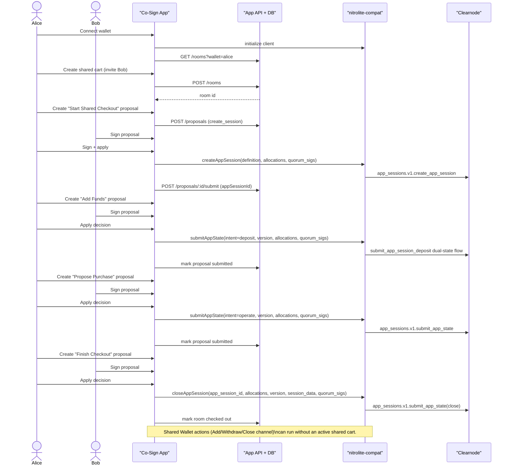

# Co-Sign Checkout Demo

This demo is a "shared wallet + shared cart approval" experience powered by Nitrolite.

---

## Part 1: Alice & Bob Story

Alice and Bob work together and need to buy tools every month.

They agree on one rule:
- no purchase happens unless both approve.

So they use **Co-Sign Checkout**.

1. Alice creates a **shared cart** and invites Bob.
2. They both click **Start Shared Checkout** once.
3. Alice adds money from her wallet into the shared checkout balance.
4. Alice proposes a purchase ("Monthly tooling checkout").
5. Bob reviews it and agrees.
6. The purchase is applied only after both approvals.
7. When done, they click **Finish Checkout**.

Think of this like:
- "Shared cart" = the conversation + approvals between two people
- "Shared checkout balance" = money reserved for this cart
- "Apply decision" = lock in the approved action

---

## Part 2: What The Demo Actually Does (Nitrolite Mapping)

### Main product actions

| Human action in app | What app sends | Protocol meaning |
| --- | --- | --- |
| Connect wallet | client init + account/session refresh | Identifies participant and loads balances/channels/sessions |
| Create shared cart | `POST /api/rooms` | Creates room metadata for two participants |
| Start Shared Checkout | `create_app_session` (through compat `createAppSession`) | Creates App Session with 50/50 quorum |
| Add Funds To Checkout | `submit_app_state` with `intent=deposit` (compat routes to deposit flow) | Moves funds from user's channel into app-session allocations |
| Propose Purchase | `submit_app_state` with `intent=operate` | Reallocates funds inside app session after quorum signatures |
| Finish Checkout | `submit_app_state` with close intent | Closes app session and marks room checked out |

### Wallet funds actions (independent from cart state)

The **Shared Wallet** panel manages channel funds directly:
- Add Funds (deposit into ledger channel)
- Withdraw To Wallet (move ledger funds back on-chain)
- Close Shared Wallet channel

Important:
- You can withdraw to your on-chain wallet **even when no shared cart is active**.
- Cart status does not block wallet fund recovery.

---

## End-to-End Flow Diagram



---

## Security & Access Rules In This Demo

- Room timeline/proposals are shown only to participants.
- Visiting `/r/:roomId` without a connected invited wallet redirects home.
- Visiting `/r/:roomId` with a non-participant wallet redirects home.

---

## Local Run

```bash
cd /Users/maharshimishra/Documents/nitrolite/cosign-demo
npm install
npm run dev
```
